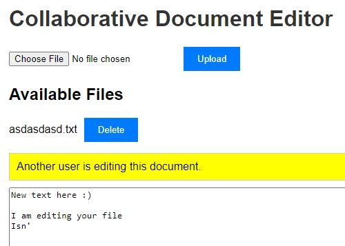

# Collaborative File System

Welcome to the Collaborative File System project! This application allows multiple users to collaborate on file editing, transfer, and storage securely. Built using the MERN stack, this application supports real-time collaborative editing and ensures data integrity and security.



## Table of Contents

- [Features](#features)
- [Technologies Used](#technologies-used)
- [Installation](#installation)
- [Usage](#usage)
- [Contributing](#contributing)
- [License](#license)
- [Contact](#contact)

## Features

- **Real-time Collaboration**: Multiple users can edit files simultaneously.
- **File Storage**: Securely store files with version control. *(TODO)*
- **File Transfer**: Easy file sharing and transfer between users. *(TODO)*
- **User Authentication**: Secure login and registration system.
- **Access Control**: Manage permissions for different users. *(TODO)*
- **Responsive Design**: Works on both desktop and mobile devices. *(TODO)*

## Technologies Used

- **Frontend**: React
- **Backend**: Node.js, Express.js
- **Database**: MongoDB
- **Authentication**: JWT (JSON Web Tokens)
- **Real-time Communication**: Socket.io
- **Containerization**: Docker *(TODO)*
- **Deployment**: AWS (or other cloud providers) *(TODO)*

## Installation

To get a local copy up and running, follow these steps:

1. **Clone the repository**
    ```sh
    git clone https://github.com/JJeCho/collab_file_system.git
    cd collab_file_system
    ```

2. **Install dependencies**
    ```sh
    npm install
    cd client
    npm install
    cd ..
    ```

3. **Set up environment variables**

    Create a `.env` file in the root directory and add the following variables:
    ```sh
    MONGO_URI=your_mongo_db_connection_string
    JWT_SECRET=your_jwt_secret
    ```

4. **Run the application**
    ```sh
    npm run dev
    ```

## Usage

1. **Register an account**
2. **Log in with your credentials**
3. **Upload files**
4. **Share files with other users** *(TODO)*
5. **Collaborate in real-time**

## Contributing

Contributions are what make the open-source community such an amazing place to learn, inspire, and create. Any contributions you make are **greatly appreciated**.

1. Fork the Project
2. Create your Feature Branch (`git checkout -b feature/AmazingFeature`)
3. Commit your Changes (`git commit -m 'Add some AmazingFeature'`)
4. Push to the Branch (`git push origin feature/AmazingFeature`)
5. Open a Pull Request

## License

Distributed under the MIT License. See `LICENSE` for more information.

## Contact

JJeCho - [GitHub](https://github.com/JJeCho) - [LinkedIn](https://www.linkedin.com/in/jjecho55/)

Project Link: [https://github.com/JJeCho/collab_file_system](https://github.com/JJeCho/collab_file_system)
